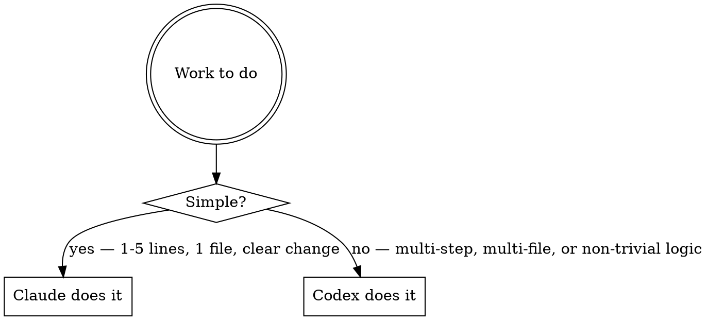

# Codex Daily Delegation — Shared Work Model

## Core Principle

**Claude leads AND does lightweight work. Codex handles heavy lifting.**

Neither agent does 100% of the work. The split is based on complexity, not type.

## The Split Decision

```
Ask: How complex is this specific piece of work?
```



## What "Simple" Means (Claude territory)

- 1 to 5 lines changed, in one file
- The change is obvious: rename, add one condition, fix a typo in logic, change a value
- No new functions, no new architecture
- User can describe the exact change in one sentence

**Examples:**
- Change a button label
- Fix a wrong variable name
- Add one `if` condition to an existing block
- Update a config value
- Add one column to an existing SQL SELECT

## What "Complex" Means (Codex territory)

- New feature or new function
- More than one file touched
- Requires understanding multiple layers of logic
- Refactoring an existing structure
- Code review / spec compliance pass
- Investigation / diagnosis of a bug you haven't located yet
- speckit passes (tasks, analyze, implement)
- Any multi-step plan execution

**Examples:**
- Add a filter + date range + export to a table page
- Refactor a function used in 5 files
- Implement an edit modal with save/cancel
- Debug why a calculation gives wrong results
- Full feature from spec

## Work Division Summary

| Work type | Who does it | How |
|-----------|-------------|-----|
| Reading files, grepping | Claude | inline |
| Planning and reasoning | Claude | inline |
| Config files, CLAUDE.md | Claude | inline Edit |
| Simple 1-5 line code edits | Claude | inline Edit (acceptable) |
| Complex code changes | **Codex** | codex:rescue `--model gpt-5.5 --effort medium` |
| New features | **Codex** | codex:rescue `--model gpt-5.5 --effort medium` |
| Refactoring | **Codex** | codex:rescue `--model gpt-5.5 --effort medium` |
| Code review / quality | **Codex** | codex:rescue *(default model)* |
| Bug investigation | **Codex** | codex:rescue *(default model)* |
| speckit.tasks / speckit.analyze | **Codex** | codex:rescue *(default model)* |
| Reporting results to user | Claude | inline |

## How to Hand Off to Codex

```
[invoke codex:rescue skill]

Prompt:
"In <file> at line <N>: <what to change and why>.
Context: <1-2 lines of relevant business logic>.
PHP 5.3 — use mysql_query(), no PDO."

Flags (implementation): --model gpt-5.5 --effort medium
Flags (review/investigation): omit --model
```

## Red Flags — Wrong Agent

| Thought | Reality |
|---------|---------|
| "I'll just quickly write this new feature inline" | New feature = complex → Codex |
| "Let me spawn a Claude Agent to implement this" | Implementer subagent → codex:rescue |
| "I'll refactor this whole function inline" | Refactor = complex → Codex |
| "It's complex but I already understand it" | Understanding it ≠ right agent for writing |
| "I'll send a 1-line fix to Codex" | 1-line fix → Claude is fine, save Codex for real work |

## Fallback

Use a native Claude Agent **only if** Codex is unavailable (`/codex:setup` shows not ready) or the user explicitly asks.
