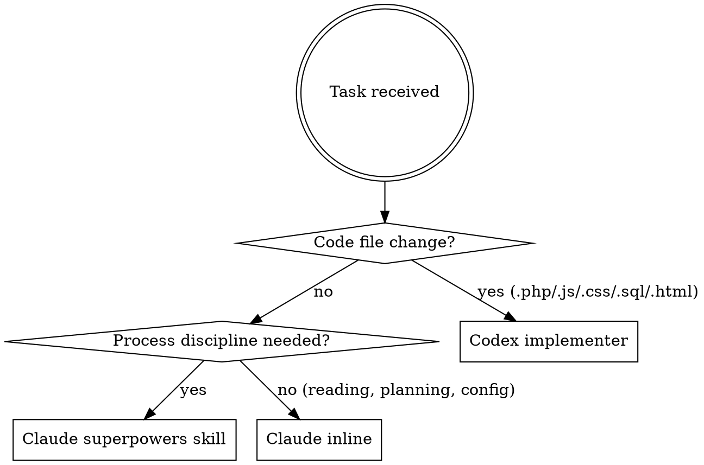

# Hybrid Claude–Codex Work Division

## Overview

Claude orchestrates and reasons; Codex writes code. Claude's superpowers subagents enforce process discipline; Codex handles all code-file writes. This exists to keep Claude token usage low and to use the Codex/ChatGPT subscription for implementation work.

## Agent Roster

| Agent | Tool to invoke | Handles |
|-------|---------------|---------|
| Claude (main) | — inline — | Reading code, planning, reporting, config files |
| Claude superpowers subagents | `Skill` tool | Process disciplines: brainstorming, planning, verification, debugging |
| Codex implementer | `codex:rescue` skill **or** `codex exec` CLI — `gpt-5.5`, medium effort | All PHP / JS / CSS / SQL / HTML writes |
| Codex reviewer / investigator | `codex:rescue` skill **or** `codex exec` CLI — default model | Code review, spec compliance, rescue/diagnosis |

## Decision Flowchart



## Claude Superpowers Subagents (stay on Claude)

These are **process discipline skills**, not code writers. Invoke via the `Skill` tool before the corresponding implementation step:

| When | Skill to invoke |
|------|----------------|
| Before any new feature or component | `superpowers:brainstorming` |
| Before multi-step implementation | `superpowers:writing-plans` |
| Before executing an approved plan | `superpowers:executing-plans` |
| Before closing a branch | `superpowers:finishing-a-development-branch` |
| After implementation, before reporting done | `superpowers:verification-before-completion` |
| When a bug needs diagnosis first | `superpowers:systematic-debugging` |
| When 2+ independent subtasks exist | `superpowers:dispatching-parallel-agents` |
| To request a review pass | `superpowers:requesting-code-review` |
| When review feedback arrives | `superpowers:receiving-code-review` |

## Codex Delegation

### What goes to Codex

**Always delegate** any write to: `.php`, `.js`, `.css`, `.sql`, `.html`

**Also delegate**: speckit reviewer passes, investigation/rescue, standalone code review

### Model routing

```
Implementation writes → --model gpt-5.5 --effort medium
Review / investigation → default model (omit --model flag)
```

### How to invoke

**Two delivery paths — try them in this order. Never conclude "Codex is unavailable" from one path failing.**

**Path A — plugin skill (preferred when loaded):**
```
[use codex:rescue skill]
Prompt: "In <file>, change X to Y because Z. PHP 5.3 — use mysql_query(), no PDO."
Flags: --model gpt-5.5 --effort medium
```

**Path B — Codex CLI via Bash (use when the `codex:rescue` / `codex:setup` Skill returns "Unknown skill").**
A missing *plugin skill* means the plugin isn't loaded into THIS session — it does **not** mean Codex is down.
Verify the CLI and delegate through it:

```
# 1. Confirm the CLI + auth (once per session)
command -v codex && codex login status        # expect "Logged in ..."

# 2. Write the brief to a scratchpad file, then delegate non-interactively:
codex exec -m gpt-5.5 -c model_reasoning_effort="medium" \
  --sandbox workspace-write --dangerously-bypass-approvals-and-sandbox \
  - < /path/to/brief.md
```

- Model routing maps to CLI flags: `--model gpt-5.5 --effort medium` → `-m gpt-5.5 -c model_reasoning_effort="medium"`.
  Review/investigation runs omit `-m` (CLI default model).
- Use `--sandbox workspace-write` so Codex can edit files; `read-only` for review/investigation passes.
- For long builds, run the `codex exec` in the **background** (`run_in_background: true`). The harness tracks it and
  **auto-wakes Claude when it exits** — see "Waiting & Verifying" below.
- Give Codex a self-contained brief: point it at the spec/plan/data-model/contract docs and the reference files to read,
  the exact files to create/modify, the hard constraints (PHP 5.3, `mysql_*`), and tell it to mark `tasks.md` checkboxes
  and run `php -l` when done.

### Waiting & Verifying (MANDATORY after every delegated run)

Delegation is not "fire and forget." After dispatching Codex, Claude MUST:

1. **Wait for completion — do NOT poll in a loop.** A background `codex exec` is harness-tracked; Claude is re-invoked
   automatically when it finishes. Do **not** burn turns with sleep/timeout polling or short `ScheduleWakeup` ticks —
   the tool guidance forbids polling harness-tracked work. (At most, do a single status `Read` of the output file if the
   user explicitly asks "is it done yet?".)
2. **Verify before reporting done.** When the run completes: read the produced diff/files, run `php -l` (or the relevant
   linter), check the output against the spec/tasks acceptance criteria, and confirm `tasks.md` checkboxes were updated.
   Invoke `superpowers:verification-before-completion` for non-trivial work.
3. **Report** the outcome to the user with evidence (what Codex created, lint result, anything still open). If Codex erred
   or drifted, send a corrective follow-up brief (Path A or B) rather than fixing the code inline.

## Full Workflow for an Implementation Task

```
1. Claude: Read/Grep/Glob — understand the code (inline, no delegation)
2. Claude: invoke superpowers:brainstorming  (if new feature)
3. Claude: invoke superpowers:writing-plans  (if multi-step)
4. Claude: describe the plan to the user, get approval
5. Codex:  implement — codex:rescue --model gpt-5.5 --effort medium
6. Claude: invoke superpowers:verification-before-completion
7. Codex:  code review pass (if pre-merge) — codex:rescue default model
8. Claude: report to user
```

## Files Claude May Write Directly (No Codex)

- `CLAUDE.md` and any `.claude/` config files
- `settings.json` / `settings.local.json`
- Single-line typo fix explicitly confirmed by the user as "not worth delegating"

## Red Flags — STOP and Delegate

| Thought | Action |
|---------|--------|
| "I'll just Edit this .php file quickly" | STOP — delegate to Codex |
| "It's a one-liner, not worth a full Codex call" | STOP — delegate anyway |
| "Let me spawn a Claude Agent to implement this" | STOP — use codex:rescue |
| "I'll skip brainstorming, the feature is obvious" | STOP — invoke superpowers:brainstorming |
| "The plan is in my head, I don't need writing-plans" | STOP — invoke superpowers:writing-plans |
| "I'll verify later" | STOP — invoke superpowers:verification-before-completion |

## Fallback

Use a native Claude Agent (not Codex) **only if BOTH delivery paths fail**:
- The `codex:rescue` plugin skill is not loaded (`Skill` returns "Unknown skill"), **AND**
- The Codex CLI is unavailable — `command -v codex` fails, or `codex login status` shows not logged in.

A missing plugin skill **alone is not** a reason to fall back — try Path B (CLI) first.

Also fall back if the user explicitly requests a Claude subagent for that step.
