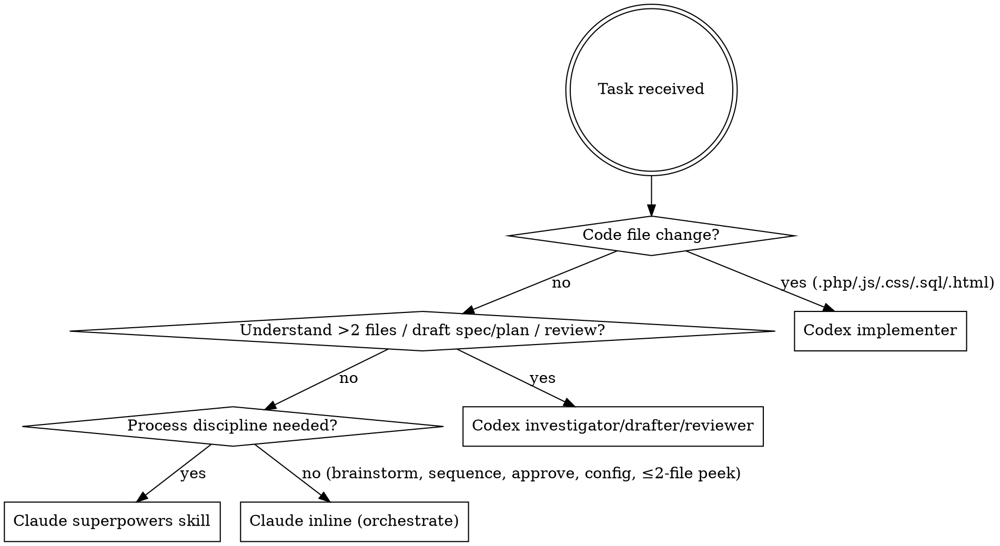

# Hybrid Claude–Codex Work Division

## Overview

Claude **conducts**; Codex **does the heavy lifting**. Claude's superpowers subagents enforce process discipline; Codex handles code writes, codebase investigation, spec/plan drafting, and review. This exists to keep Claude token usage low and to use the Codex/ChatGPT subscription for the token-heavy work.

> **Why this matters (the 80/10 problem):** implementation is the *smallest* slice of token spend. Reading the codebase, drafting specs/plans, and review are what burn Claude's limit. Delegating only code-writing leaves Claude at ~80–90% and Codex at ~10%. To rebalance, **delegate investigation, spec/plan drafting, and review to Codex too** — not just implementation. Claude keeps only: brainstorming dialogue, orchestration/sequencing, applying user-approved decisions, and the final report.

## Agent Roster

| Agent | Tool to invoke | Handles |
|-------|---------------|---------|
| Claude (main) | — inline — | **Orchestration only:** brainstorming dialogue, sequencing, approving, reporting, config files, ≤2-file quick peeks |
| Claude superpowers subagents | `Skill` tool | Process disciplines: brainstorming, planning, verification, debugging |
| Codex implementer | **Agent tool** (`subagent_type: "codex:codex-rescue"`) **or** `codex exec` CLI — `gpt-5.5`, medium effort | All PHP / JS / CSS / SQL / HTML writes |
| Codex investigator / reviewer / drafter | **Agent tool** (`subagent_type: "codex:codex-rescue"`) **or** `codex exec` CLI — default model | **Codebase investigation (>2 files), spec/plan drafting, speckit.tasks/analyze, code review, rescue/diagnosis** |

> ⚠️ **NEVER** delegate to Codex via the `Skill` tool. `Skill(codex:rescue)` re-enters the slash command and **hangs the session**; `Skill(codex:codex-rescue)` is not a skill. Use the **Agent tool** (`subagent_type: "codex:codex-rescue"`), or the `codex exec` CLI (Path B), or ask the user to type `/codex:rescue`.

## Decision Flowchart



## Claude Superpowers Subagents (stay on Claude)

These are **process discipline skills**, not code writers. Invoke via the `Skill` tool before the corresponding implementation step:

| When | Skill to invoke |
|------|----------------|
| Before any new feature or component | `superpowers:brainstorming` |
| Before multi-step implementation | `superpowers:writing-plans` |
| Before executing an approved plan | `superpowers:executing-plans` |
| Before closing a branch | `superpowers:finishing-a-development-branch` |
| After implementation, before reporting done | `superpowers:verification-before-completion` |
| When a bug needs diagnosis first | `superpowers:systematic-debugging` |
| When 2+ independent subtasks exist | `superpowers:dispatching-parallel-agents` |
| To request a review pass | `superpowers:requesting-code-review` |
| When review feedback arrives | `superpowers:receiving-code-review` |

## Codex Delegation

### What goes to Codex

**Always delegate** any write to: `.php`, `.js`, `.css`, `.sql`, `.html`

**Also delegate (these are the rebalancing wins — do NOT do them inline):**

1. **Codebase investigation / reading >2 files.** Instead of Claude running Read/Grep/Glob across many files, send Codex: *"Read files X/Y/Z, trace how feature F works, report a summary + the exact functions/lines to change."* Codex returns a digest; Claude orchestrates from the digest. Claude may still do a quick ≤2-file peek inline.
2. **Spec & plan *drafting*.** `speckit.specify` / `speckit.plan` produce huge text artifacts — let Codex draft `spec.md` / `plan.md`; Claude reviews, tweaks, and approves. (Brainstorming dialogue with the user stays on Claude.)
3. **`speckit.tasks` + `speckit.analyze`** — always via Codex, never inline.
4. **Review & verification** — `requesting-code-review` passes, running linters/tests, checking output against acceptance criteria.

**Stays on Claude:** brainstorming dialogue, sequencing/orchestration, applying *your* approved decisions, the final report.

### Model routing

```
Implementation writes → --model gpt-5.5 --effort medium
Review / investigation → default model (omit --model flag)
```

### How to invoke

**Two delivery paths — try them in this order. Never conclude "Codex is unavailable" from one path failing.**

**Path A — Agent tool (preferred when the subagent is registered):**
```
Agent tool → subagent_type: "codex:codex-rescue"
Prompt: "In <file>, change X to Y because Z. PHP 5.3 — use mysql_query(), no PDO."
Flags forwarded: --model gpt-5.5 --effort medium   (omit --model for review/investigation)
```
⚠️ Do **NOT** use the `Skill` tool for this. `Skill(codex:rescue)` re-enters the slash command and hangs;
`Skill(codex:codex-rescue)` is not a skill. Delegation goes through the **Agent tool** only.

**Path B — Codex CLI via Bash (use when the `codex:codex-rescue` Agent type is "not found" this session,
e.g. resumed sessions or some CLI builds).**
A missing Agent type means the plugin isn't registered into THIS session — it does **not** mean Codex is down.
Verify the CLI and delegate through it:

```
# 1. Confirm the CLI + auth (once per session)
command -v codex && codex login status        # expect "Logged in ..."

# 2. Write the brief to a scratchpad file, then delegate non-interactively:
codex exec -m gpt-5.5 -c model_reasoning_effort="medium" \
  --sandbox workspace-write --dangerously-bypass-approvals-and-sandbox \
  - < /path/to/brief.md
```

- Model routing maps to CLI flags: `--model gpt-5.5 --effort medium` → `-m gpt-5.5 -c model_reasoning_effort="medium"`.
  Review/investigation runs omit `-m` (CLI default model).
- Use `--sandbox workspace-write` so Codex can edit files; `read-only` for review/investigation passes.
- For long builds, run the `codex exec` in the **background** (`run_in_background: true`). The harness tracks it and
  **auto-wakes Claude when it exits** — see "Waiting & Verifying" below.
- Give Codex a self-contained brief: point it at the spec/plan/data-model/contract docs and the reference files to read,
  the exact files to create/modify, the hard constraints (PHP 5.3, `mysql_*`), and tell it to mark `tasks.md` checkboxes
  and run `php -l` when done.

### Waiting & Verifying (MANDATORY after every delegated run)

Delegation is not "fire and forget." After dispatching Codex, Claude MUST:

1. **Wait for completion — do NOT poll in a loop.** A background `codex exec` is harness-tracked; Claude is re-invoked
   automatically when it finishes. Do **not** burn turns with sleep/timeout polling or short `ScheduleWakeup` ticks —
   the tool guidance forbids polling harness-tracked work. (At most, do a single status `Read` of the output file if the
   user explicitly asks "is it done yet?".)
2. **Verify before reporting done.** When the run completes: read the produced diff/files, run `php -l` (or the relevant
   linter), check the output against the spec/tasks acceptance criteria, and confirm `tasks.md` checkboxes were updated.
   Invoke `superpowers:verification-before-completion` for non-trivial work.
3. **Report** the outcome to the user with evidence (what Codex created, lint result, anything still open). If Codex erred
   or drifted, send a corrective follow-up brief (Path A or B) rather than fixing the code inline.

## Full Workflow for an Implementation Task

```
1. Codex:  investigate — read the relevant files, trace the feature, return a digest
           (Agent tool subagent_type "codex:codex-rescue", default model)
           [Claude may skip to step 2 only if ≤2 files — quick inline peek allowed]
2. Claude: invoke superpowers:brainstorming  (if new feature) — dialogue stays on Claude
3. Codex:  draft spec/plan (speckit.specify / speckit.plan / writing-plans) from the digest
4. Claude: review the draft, tweak, describe to the user, get approval
5. Codex:  speckit.tasks + speckit.analyze (Agent tool, default model)
6. Codex:  implement — Agent tool subagent_type "codex:codex-rescue" --model gpt-5.5 --effort medium
7. Claude: invoke superpowers:verification-before-completion (orchestrate the check)
8. Codex:  code review pass (if pre-merge) — Agent tool, default model
9. Claude: report to user
```

Claude's job across these steps is to **sequence, decide, approve, and report** — not to read files or
write artifacts itself. The token-heavy reading/drafting/reviewing lives in Codex.

## Files Claude May Write Directly (No Codex)

- `CLAUDE.md` and any `.claude/` config files
- `settings.json` / `settings.local.json`
- Single-line typo fix explicitly confirmed by the user as "not worth delegating"

## Red Flags — STOP and Delegate

| Thought | Action |
|---------|--------|
| "I'll just Edit this .php file quickly" | STOP — delegate to Codex |
| "It's a one-liner, not worth a full Codex call" | STOP — delegate anyway |
| "Let me spawn a Claude Agent to implement this" | STOP — Agent tool `codex:codex-rescue` |
| "I'll just Read/Grep these 10 files to understand it" | STOP — delegate investigation to Codex; return a digest |
| "I'll draft the spec/plan myself, it's faster" | STOP — Codex drafts, Claude reviews |
| "I'll run speckit.tasks/analyze inline" | STOP — delegate to Codex |
| "I'll call codex:rescue via the Skill tool" | STOP — that HANGS; use the Agent tool |
| "I'll skip brainstorming, the feature is obvious" | STOP — invoke superpowers:brainstorming |
| "The plan is in my head, I don't need writing-plans" | STOP — invoke superpowers:writing-plans |
| "I'll verify later" | STOP — invoke superpowers:verification-before-completion |

## Fallback

Use a native Claude Agent (not Codex) **only if BOTH delivery paths fail**:
- The `codex:codex-rescue` Agent type is not registered (Agent tool errors "Agent type not found"), **AND**
- The Codex CLI is unavailable — `command -v codex` fails, or `codex login status` shows not logged in.

A missing Agent type **alone is not** a reason to fall back — try Path B (CLI) first.

Also fall back if the user explicitly requests a Claude subagent for that step.
